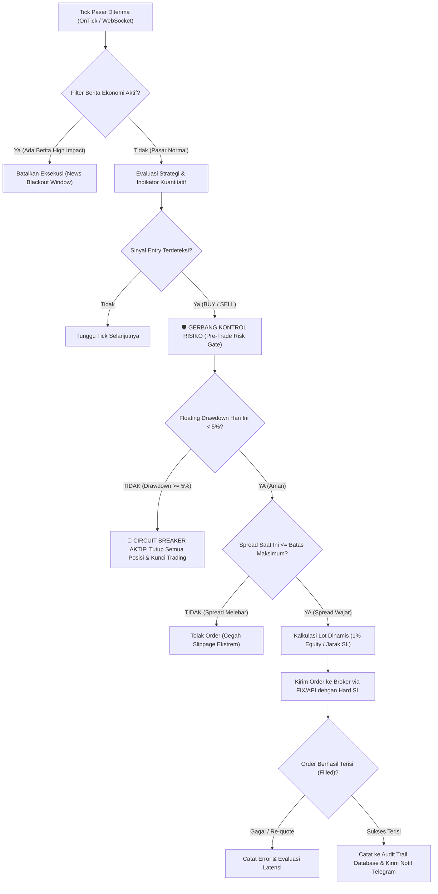

# Algorithmic & EA Trading Execution & Risk Flow

Diagram alur ini menjelaskan proses pemfilteran risiko sebelum order dikirimkan ke pasar finansial:

```mermaid
graph TD
    Start["Tick Pasar Diterima (OnTick / WebSocket)"] --> NewsCheck{"Filter Berita Ekonomi Aktif?"}
    
    NewsCheck -- "Ya (Ada Berita High Impact)" --> Skip["Batalkan Eksekusi (News Blackout Window)"]
    NewsCheck -- "Tidak (Pasar Normal)" --> SignalGen["Evaluasi Strategi & Indikator Kuantitatif"]
    
    SignalGen --> HasSignal{"Sinyal Entry Terdeteksi?"}
    HasSignal -- "Tidak" --> Wait["Tunggu Tick Selanjutnya"]
    HasSignal -- "Ya (BUY / SELL)" --> RiskGate["🛡️ GERBANG KONTROL RISIKO (Pre-Trade Risk Gate)"]
    
    RiskGate --> DDCheck{"Floating Drawdown Hari Ini < 5%?"}
    DDCheck -- "TIDAK (Drawdown >= 5%)" --> CircuitBreaker["🚨 CIRCUIT BREAKER AKTIF: Tutup Semua Posisi & Kunci Trading"]
    DDCheck -- "YA (Aman)" --> SpreadCheck{"Spread Saat Ini <= Batas Maksimum?"}
    
    SpreadCheck -- "TIDAK (Spread Melebar)" --> RejectSpread["Tolak Order (Cegah Slippage Ekstrem)"]
    SpreadCheck -- "YA (Spread Wajar)" --> LotCalc["Kalkulasi Lot Dinamis (1% Equity / Jarak SL)"]
    
    LotCalc --> SendOrder["Kirim Order ke Broker via FIX/API dengan Hard SL"]
    SendOrder --> OrderStatus{"Order Berhasil Terisi (Filled)?"}
    
    OrderStatus -- "Gagal / Re-quote" --> RequoteLog["Catat Error & Evaluasi Latensi"]
    OrderStatus -- "Sukses Terisi" --> LogDB["Catat ke Audit Trail Database & Kirim Notif Telegram"]
```
