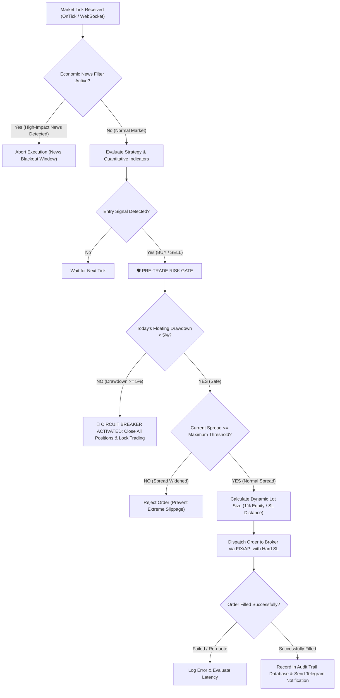

# Algorithmic & EA Trading Execution & Risk Flow

This flow diagram illustrates the pre-trade risk-filtering process before an order is dispatched to financial markets:

```mermaid
graph TD
    Start["Market Tick Received (OnTick / WebSocket)"] --> NewsCheck{"Economic News Filter Active?"}
    
    NewsCheck -- "Yes (High-Impact News Detected)" --> Skip["Abort Execution (News Blackout Window)"]
    NewsCheck -- "No (Normal Market)" --> SignalGen["Evaluate Strategy & Quantitative Indicators"]
    
    SignalGen --> HasSignal{"Entry Signal Detected?"}
    HasSignal -- "No" --> Wait["Wait for Next Tick"]
    HasSignal -- "Yes (BUY / SELL)" --> RiskGate["🛡️ PRE-TRADE RISK GATE"]
    
    RiskGate --> DDCheck{"Today's Floating Drawdown < 5%?"}
    DDCheck -- "NO (Drawdown >= 5%)" --> CircuitBreaker["🚨 CIRCUIT BREAKER ACTIVATED: Close All Positions & Lock Trading"]
    DDCheck -- "YES (Safe)" --> SpreadCheck{"Current Spread <= Maximum Threshold?"}
    
    SpreadCheck -- "NO (Spread Widened)" --> RejectSpread["Reject Order (Prevent Extreme Slippage)"]
    SpreadCheck -- "YES (Normal Spread)" --> LotCalc["Calculate Dynamic Lot Size (1% Equity / SL Distance)"]
    
    LotCalc --> SendOrder["Dispatch Order to Broker via FIX/API with Hard SL"]
    SendOrder --> OrderStatus{"Order Filled Successfully?"}
    
    OrderStatus -- "Failed / Re-quote" --> RequoteLog["Log Error & Evaluate Latency"]
    OrderStatus -- "Successfully Filled" --> LogDB["Record in Audit Trail Database & Send Telegram Notification"]
```
