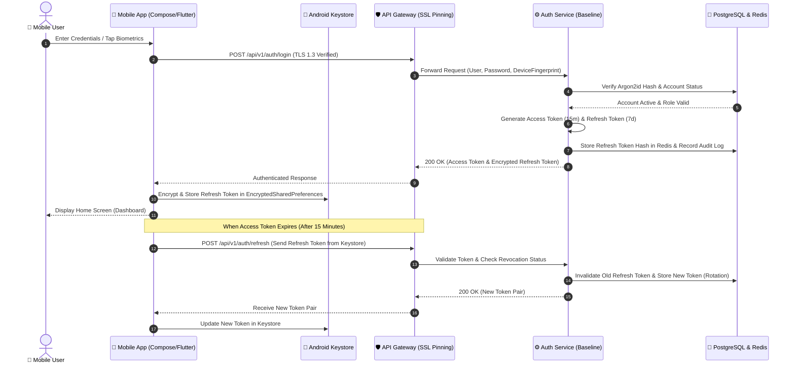

# Mobile Authentication & Token Lifecycle Sequence

This interaction sequence diagram illustrates the secure authentication flow on mobile devices utilizing Android Keystore and automated refresh token rotation:

