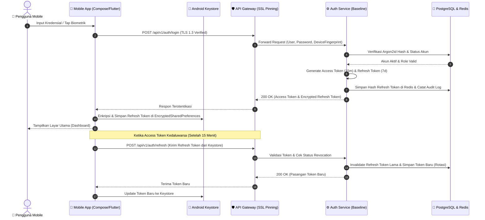

# Mobile Authentication & Token Lifecycle Sequence

Diagram interaksi ini menjelaskan alur otentikasi aman pada perangkat mobile menggunakan Android Keystore dan rotasi refresh token otomatis:

```mermaid
sequenceDiagram
    autonumber
    actor User as 👤 Pengguna Mobile
    participant App as 📱 Mobile App (Compose/Flutter)
    participant Store as 🔐 Android Keystore
    participant Gateway as 🛡️ API Gateway (SSL Pinning)
    participant AuthAPI as ⚙️ Auth Service (Baseline)
    participant DB as 💾 PostgreSQL & Redis

    User->>App: Input Kredensial / Tap Biometrik
    App->>Gateway: POST /api/v1/auth/login (TLS 1.3 Verified)
    Gateway->>AuthAPI: Forward Request (User, Password, DeviceFingerprint)
    AuthAPI->>DB: Verifikasi Argon2id Hash & Status Akun
    DB-->>AuthAPI: Akun Aktif & Role Valid
    AuthAPI->>AuthAPI: Generate Access Token (15m) & Refresh Token (7d)
    AuthAPI->>DB: Simpan Hash Refresh Token di Redis & Catat Audit Log
    AuthAPI-->>Gateway: 200 OK (Access Token & Encrypted Refresh Token)
    Gateway-->>App: Respon Terotentikasi

    App->>Store: Enkripsi & Simpan Refresh Token di EncryptedSharedPreferences
    App-->>User: Tampilkan Layar Utama (Dashboard)

    Note over App,Gateway: Ketika Access Token Kedaluwarsa (Setelah 15 Menit)
    App->>Gateway: POST /api/v1/auth/refresh (Kirim Refresh Token dari Keystore)
    Gateway->>AuthAPI: Validasi Token & Cek Status Revocation
    AuthAPI->>DB: Invalidate Refresh Token Lama & Simpan Token Baru (Rotasi)
    AuthAPI-->>Gateway: 200 OK (Pasangan Token Baru)
    Gateway-->>App: Terima Token Baru
    App->>Store: Update Token Baru ke Keystore
```
