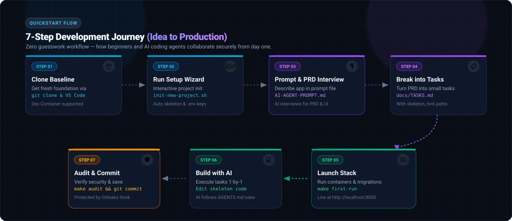
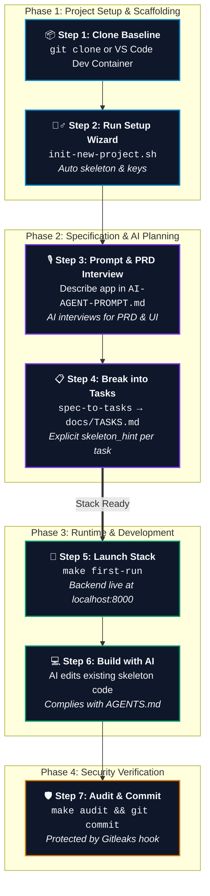

# 🚀 7-Step Quickstart Workflow Diagram

> **Visual Flowchart of the Aegis Forge 7-Step Development Journey** — from project clone to secure production commit.

---

## 🎨 Visual Diagram (Vector SVG)

---

## 📊 Mermaid Flowchart

