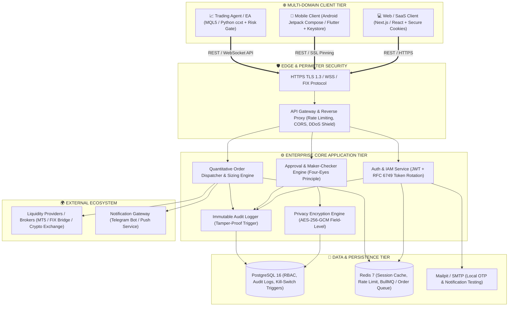

# Universal Multi-Domain System Architecture

This diagram visualizes how the Web, Mobile App, and EA Trading Engine interfaces integrate seamlessly into the Aegis Forge ecosystem:

```mermaid
graph TB
    subgraph Clients["🌐 MULTI-DOMAIN CLIENT TIER"]
        direction TB
        WEB["💻 Web / SaaS Client (Next.js / React + Secure Cookies)"]
        MOB["📱 Mobile Client (Android Jetpack Compose / Flutter + Keystore)"]
        EA["📈 Trading Agent / EA (MQL5 / Python ccxt + Risk Gate)"]
    end

    subgraph Edge["🛡️ EDGE & PERIMETER SECURITY"]
        direction TB
        TLS["HTTPS TLS 1.3 / WSS / FIX Protocol"]
        WAF["API Gateway & Reverse Proxy (Rate Limiting, CORS, DDoS Shield)"]
        TLS --> WAF
    end

    subgraph CoreServices["⚙️ ENTERPRISE CORE APPLICATION TIER"]
        direction TB
        AUTH["Auth & IAM Service (JWT + RFC 6749 Token Rotation)"]
        SOD["Approval & Maker-Checker Engine (Four-Eyes Principle)"]
        TRADE_ENGINE["Quantitative Order Dispatcher & Sizing Engine"]
        FLE["Privacy Encryption Engine (AES-256-GCM Field-Level)"]
        AUDIT["Immutable Audit Logger (Tamper-Proof Trigger)"]
        
        WAF --> AUTH
        WAF --> SOD
        WAF --> TRADE_ENGINE
        AUTH --> AUDIT
        SOD --> FLE
        SOD --> AUDIT
        TRADE_ENGINE --> AUDIT
    end

    subgraph DataStorage["💾 DATA & PERSISTENCE TIER"]
        direction TB
        PG[("PostgreSQL 16 (RBAC, Audit Logs, Kill-Switch Triggers)")]
        REDIS[("Redis 7 (Session Cache, Rate Limit, BullMQ / Order Queue)")]
        MAIL["Mailpit / SMTP (Local OTP & Notification Testing)"]
        
        AUTH --> REDIS
        AUTH --> MAIL
        FLE --> PG
        TRADE_ENGINE --> REDIS
        AUDIT --> PG
    end

    subgraph External["🌍 EXTERNAL ECOSYSTEM"]
        direction TB
        BROKER["Liquidity Providers / Brokers (MT5 / FIX Bridge / Crypto Exchange)"]
        NOTIF["Notification Gateway (Telegram Bot / Push Service)"]
        
        TRADE_ENGINE --> BROKER
        TRADE_ENGINE --> NOTIF
    end

    WEB ==>|"REST / HTTPS"| TLS
    MOB ==>|"REST / SSL Pinning"| TLS
    EA ==>|"REST / WebSocket API"| TLS
```
